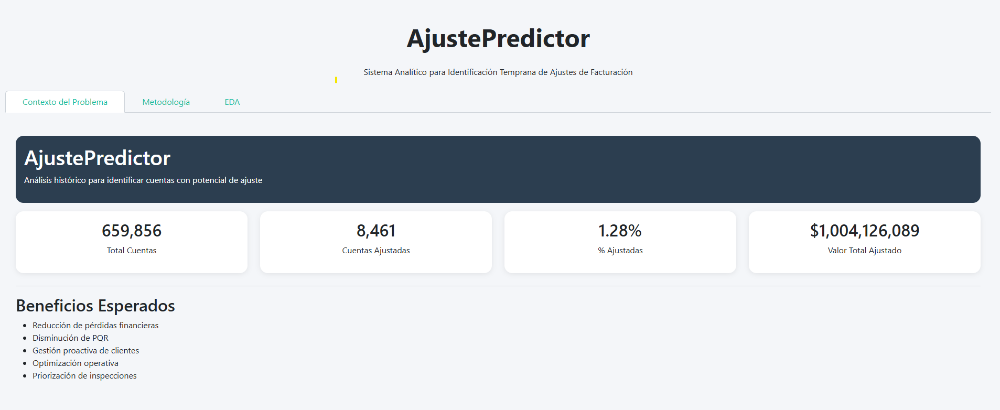

# AjustePredictor

<p align="center">
  
</p>

<p align="center">
  <strong>Sistema Analítico para Identificación Temprana de Ajustes de Facturación</strong>
</p>

---

## 📋 Descripción

**AjustePredictor** es una solución analítica desarrollada con **Python**, **Dash** y **Plotly** para analizar el comportamiento histórico de los ajustes de facturación.

El objetivo de esta primera fase es realizar un análisis exploratorio de datos (EDA) que permita identificar patrones, tendencias y variables relevantes para la construcción futura de modelos predictivos.

---

## 🎯 Objetivos

* Analizar el comportamiento histórico de los ajustes.
* Identificar variables con potencial predictivo.
* Detectar desviaciones en consumo y facturación.
* Comprender la distribución de cuentas ajustadas y no ajustadas.
* Preparar el dataset para futuras fases de Machine Learning.

---

## 🏗️ Estructura del Proyecto

```text
ajuste-predictor/
│
├── app.py
│
├── data/
│   ├── __init__.py
│   ├── data_loader.py
│   └── DataAjuste.csv
│
├── tabs/
│   ├── __init__.py
│   ├── contextoproblema.py
│   ├── metodologia.py
│   └── eda.py
│
├── assets/
│   └── custom.css
│
├── screenshots/
│   └── home.png
│
├── docs/
│   └── arquitectura.md
│
├── requirements.txt
├── README.md
├── LICENSE
└── .gitignore
```

---

## ⚙️ Requisitos

Antes de ejecutar el proyecto asegúrate de tener instalado:

* Python 3.9 o superior
* Pip
* Git (opcional)

Verifica tu versión de Python:

```bash
python --version
```

---

## 🚀 Instalación

### 1. Descargar el proyecto

Simplemente descarga y descomprime el proyecto.

---

### 2. Crear entorno virtual

#### Windows

```bash
python -m venv venv
venv\Scripts\activate
```

#### Linux / Mac

```bash
python -m venv venv
source venv/bin/activate
```

---

### 3. Instalar dependencias

```bash
pip install -r requirements.txt
```

---

## 📁 Dataset Requerido

El proyecto utiliza el archivo:

```text
DataAjuste.csv
```

Ubicación esperada:

```text
data/DataAjuste.csv
```

Separador:

```text
;
```

---

## ▶️ Ejecución

Una vez instaladas las dependencias:

```bash
python app.py
```

Si todo funciona correctamente verás un mensaje similar a:

```text
Dash is running on http://127.0.0.1:8050/
```

---

## 🌐 Acceso al Dashboard

Abrir en el navegador:

```text
http://127.0.0.1:8050
```

---

## 📊 Funcionalidades Disponibles

### Contexto del Problema

* Indicadores KPI
* Valor total ajustado
* Porcentaje de cuentas ajustadas
* Beneficios esperados

### Metodología

* Flujo analítico completo
* Variables candidatas
* Hipótesis de negocio
* Preparación para Machine Learning

### EDA Interactivo

* Distribución de ajustes
* Análisis por categoría
* Análisis por plan de facturación
* Histogramas dinámicos
* Heatmap de correlaciones
* Scatter plots
* Boxplots para evaluación de variables predictivas

---

## 🧠 Variable Objetivo

La variable objetivo utilizada para futuras fases de Machine Learning es:

```python
TARGET_AJUSTE
```

Construida como:

```python
TARGET_AJUSTE = 1 if VALOR_AJUSTE_PERIODO != 0 else 0
```

Interpretación:

| Valor | Significado |
| ----- | ----------- |
| 0     | Sin ajuste  |
| 1     | Con ajuste  |

---

## 🛣️ Roadmap

### ✅ Fase 1

* Contexto del problema
* Metodología analítica
* Exploratory Data Analysis (EDA)